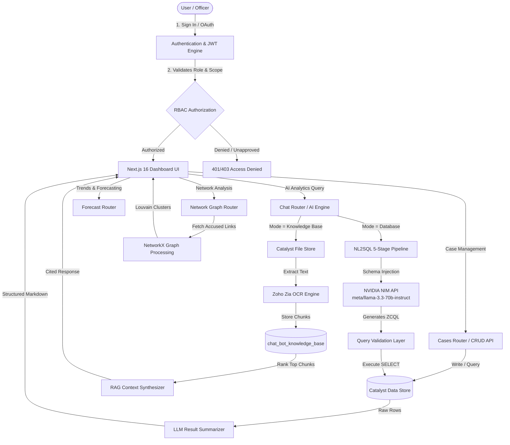
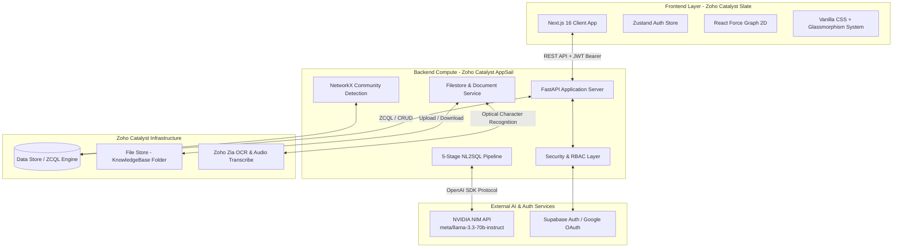
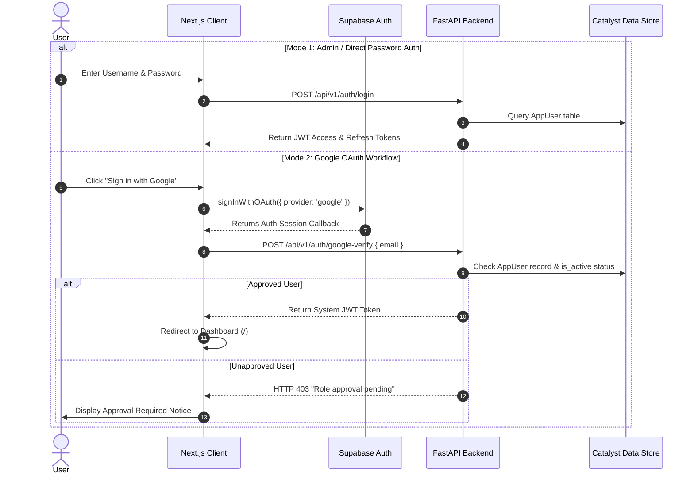
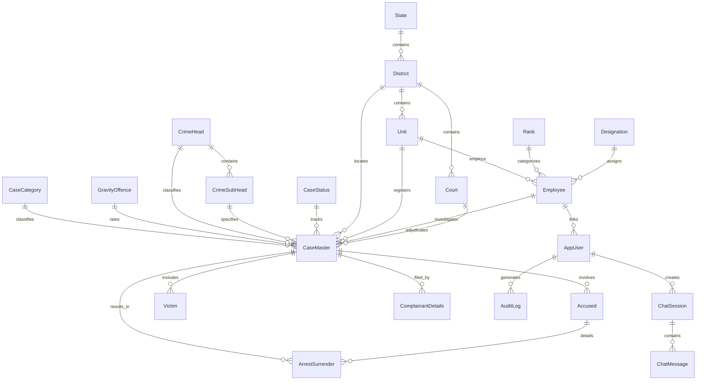
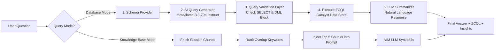

# Karnataka Police Crime Analytics Platform

> **An AI-powered, multi-tenant crime intelligence platform for tracking crime patterns, spatial forecasting, co-accused network graph visualization, and natural-language database analytics powered by NVIDIA NIM and Zoho Catalyst.**

---

## 1. Project Title

* **Project Name**: Karnataka Police Crime Analytics & Intelligence Platform (KSP Analytics)
* **Tagline**: Next-Generation AI & Graph Intelligence for Law Enforcement & Crime Pattern Analytics
* **One-Line Summary**: A comprehensive law enforcement intelligence suite built on Next.js, FastAPI, Zoho Catalyst Cloud, and NVIDIA NIM LLMs to enable natural-language ZCQL database queries, session-isolated document OCR RAG, repeat offender risk profiling, and community-detected co-accused network analysis.

---

## 2. Project Overview

### What Problem It Solves
Investigators, analysts, and law enforcement supervisors currently query state crime databases through rigid, manual forms and multi-tab legacy portals. There is no unified system to ask natural-language questions (*"Show theft hotspots in Bengaluru Urban with repeat offenders"*), automatically extract legal facts from uploaded FIR PDFs, or detect hidden criminal syndicates across multi-district cases.

### Target Users
* **Investigators**: Field police officers and station I/Os looking up case-level details, managing accused/victim entities, registering FIRs, and reviewing co-accused links.
* **Analysts**: Crime intelligence teams analyzing cross-station trends, spatial hotspots, recidivism risk models, and community clusters.
* **Supervisors**: Station House Officers (SHOs) and Superintendents of Police (SPs) overseeing district-level caseloads, station metrics, and audit logs.
* **Policymakers**: High-level officials inspecting aggregate, anonymized demographic and regional crime distribution statistics.
* **Administrators**: System administrators provisioning role-based user accounts and reviewing access approval requests.

### Why The Project Exists
This platform bridges the gap between raw FIR database records and actionable investigative intelligence. By combining relational datastores with AI intent classification, automated ZCQL query generation, graph theory (NetworkX community detection), and Zia OCR document extraction, the platform transforms static crime records into an interactive investigative assistant.

### Key Innovations
1. **5-Stage NL2SQL Pipeline**: Converts plain English/Kannada natural language queries into valid ZCQL (Zoho Catalyst Query Language) statements using NVIDIA NIM (`meta/llama-3.3-70b-instruct`) with strict read-only validation layers.
2. **Session-Scoped Document RAG**: Extracts text from uploaded FIR PDFs via Zoho Zia OCR and indexes ~800-character chunks isolated strictly by session UUID.
3. **Graph-Based Syndicate Detection**: Utilizes NetworkX and Louvain community detection to group co-accused individuals into network clusters.
4. **Polynomial Trend & Spatial Forecasting**: Projects future monthly caseload trends and spatial density hotspots.
5. **Unified Local Development Server**: Custom runner in `backend/app.py` that boots both FastAPI and Next.js concurrently when `catalyst serve` runs.

---

## 3. Demo Section

* **Live Frontend App (Zoho Catalyst Slate)**: `https://datathon-60076836035.development.catalystserverless.com`
* **Live Backend API (Zoho Catalyst AppSail)**: `https://backend1-50043690275.development.catalystappsail.in`
* **Swagger API Documentation**: `https://backend1-50043690275.development.catalystappsail.in/api/docs`

### Pre-Configured Demo Accounts

| Username | Password | Role | Access Scope | PII Access |
| :--- | :--- | :--- | :--- | :--- |
| `admin` | `admin` | Administrator | All Stations / Full System | Yes |
| `inspector_ravi` | `ravi123` | Investigator | Own Station (`station`) | Yes |
| `analyst_priya` | `priya123` | Analyst | Cross-Station Analytics | No |
| `sp_kumar` | `kumar123` | Supervisor | District-Level Oversight | Yes |

---

## 4. Features

### Feature Matrix

| Feature | Description | Status |
| :--- | :--- | :--- |
| **Role-Based Authentication (RBAC)** | Custom JWT token auth with role enforcement (`admin`, `supervisor`, `analyst`, `investigator`, `policymaker`). | Completed |
| **Google OAuth Registration Workflow** | User signup workflow requiring Admin approval before Google Sign-In access is granted. | Completed |
| **Natural-Language AI Chat (Database Mode)** | 5-stage NL2SQL pipeline executing ZCQL against Catalyst Data Store via NVIDIA NIM. | Completed |
| **Session-Scoped Knowledge Base (RAG Mode)** | PDF upload, Zoho Zia OCR text extraction, ~800-char chunking, and isolated Q&A per session. | Completed |
| **Voice Input Processing** | Speech-to-text audio transcription powered by Zoho Zia Audio Transcribe API. | Completed |
| **Cases Database Management** | Complete CRUD operations for cases, accused, victims, complainants, and arrest/surrender records. | Completed |
| **Investigator Ownership Scope** | Scope guards ensuring investigators only edit cases where `police_person_id == user.employee_id`. | Completed |
| **Co-Accused Network Graph** | Graph visualizer (`react-force-graph-2d`) with NetworkX community detection for syndicate discovery. | Completed |
| **Recidivism & Repeat Offender Risk** | Risk scoring engine evaluating prior offenses, gravity ratings, and bail status. | Completed |
| **Spatial & Trend Forecasting** | OLS polynomial regression caseload projections and geohash hotspot density mapping. | Completed |
| **District & Station Analytics** | High-level KPI summary, monthly crime distribution, and demographic suppression guards. | Completed |
| **Admin Management & Audit Trail** | User provisioning, approval request queue, database statistics, and `AuditLog` action tracking. | Completed |
| **Unified Local Development Server** | Auto-launches Next.js dev server concurrently when running `catalyst serve` locally. | Completed |

---

## 4.1 Feature Workflows

### 1. Database AI Analytics Query
* **Purpose**: Allows non-technical officers to ask natural language questions about state crime records.
* **Workflow**: User types question $\rightarrow$ Schema Provider loads tables/columns $\rightarrow$ NVIDIA NIM (`meta/llama-3.3-70b-instruct`) generates ZCQL $\rightarrow$ Validation layer checks syntax and blocks DML $\rightarrow$ ZCQL executes on Catalyst Data Store $\rightarrow$ LLM summarizes findings with exact ROWIDs.
* **Input**: User natural language string (e.g., *"Show theft cases in Bengaluru Urban"*).
* **Processing**: 5-stage NL2SQL pipeline (`app/services/nl2sql_service.py`).
* **Output**: Structured summary, bulleted key insights, statistics, exact ZCQL string, and cited case records.
* **Dependencies**: NVIDIA NIM API (`integrate.api.nvidia.com`), `catalyst_datastore_schema.json`, Catalyst ZCQL engine.
* **Error Handling**: Falls back to offline keyword classifier if NVIDIA API is unreachable or unauthenticated.

### 2. Session-Scoped Knowledge Base OCR RAG
* **Purpose**: Ingests FIR documents or legal briefs for instant context-aware Q&A isolated to a specific chat session.
* **Workflow**: File uploaded to `/session/{uuid}/documents` $\rightarrow$ Saved to Catalyst File Store (`KnowledgeBase` folder) $\rightarrow$ Text extracted using Zoho Zia OCR $\rightarrow$ Text split into ~800-char chunks $\rightarrow$ Stored in `chat_bot_knowledge_base` with `session_uuid` tag $\rightarrow$ User asks question $\rightarrow$ Keyword overlap ranks top 5 chunks $\rightarrow$ LLM synthesizes answer with `[Source: filename.pdf]` citations.
* **Input**: PDF/Image file upload and natural language document query.
* **Processing**: Zia OCR API, SQLite / Catalyst Datastore chunk indexer, overlap ranker (`app/services/kb_service.py`).
* **Output**: Document citations and extracted answer text.
* **Security Considerations**: Enforces strict `session_uuid` filtering so session $A$ can never view or query session $B$'s documents.

---

## 5. Application Workflow



---

## 6. High Level Architecture



---

## 7. Detailed Architecture

### Component Breakdown

| Component | Responsibility | Communication | Dependencies | Failure Points |
| :--- | :--- | :--- | :--- | :--- |
| **FastAPI Backend Core** | Route handling, payload validation, dependency injection. | HTTP / REST JSON | Python 3.12, Uvicorn | AppSail memory exhaustion if query limit too high. |
| **Catalyst DB Adapter** | Wraps ZCQL query execution and provides in-memory fallback for offline dev. | `zcatalyst_sdk` / REST | `catalyst_db.py` | Cloud credentials expiration (`CATALYST_AUTH_TOKEN`). |
| **NL2SQL Service** | Translates natural language into validated ZCQL SELECT statements. | HTTPS (OpenAI SDK protocol) | NVIDIA NIM API | API key invalidation or upstream NIM rate limits. |
| **KB & Document Service** | Manages PDF file uploads, Zia OCR calls, text chunking, and session retrieval. | REST API / SQLite fallback | `kb_service.py`, Zia OCR | Unreadable PDF scans or missing local `/tmp` path. |
| **Network Analytics** | Constructs co-accused adjacency matrices and computes Louvain modularity. | In-memory processing | NetworkX, NumPy, SciPy | Disconnected graph components returning empty clusters. |

---

## 8. Folder Structure

```
datathon/
├── backend/                             # FastAPI Backend Application (Catalyst AppSail)
│   ├── app/
│   │   ├── core/                        # System core modules
│   │   │   ├── config.py                # Environment & settings management (BaseSettings)
│   │   │   ├── nim_client.py            # NVIDIA NIM API client wrapper
│   │   │   ├── permissions.py           # Role-based permissions matrix & small cell suppression
│   │   │   └── security.py              # JWT token generation, password hashing & Auth dependencies
│   │   ├── db/
│   │   │   └── catalyst_db.py           # Catalyst Data Store wrapper with in-memory fallback
│   │   ├── models/                      # Pydantic schemas
│   │   │   ├── analytics.py             # KPI & forecasting payload schemas
│   │   │   ├── cases.py                 # CaseMaster, Accused, Victim entity schemas
│   │   │   ├── chat.py                  # Session & message DTOs
│   │   │   └── user.py                  # Auth, role request & user management schemas
│   │   ├── routers/                     # FastAPI route handlers
│   │   │   ├── admin.py                 # User provisioning, approval workflow, database stats
│   │   │   ├── analytics.py             # District metrics, category distribution, KPIs
│   │   │   ├── auth.py                  # Login, token refresh, role request, Google OAuth verify
│   │   │   ├── cases.py                 # Case CRUD, co-accused linking, ownership guards
│   │   │   ├── chat.py                  # AI Chat sessions, messages, document upload/delete
│   │   │   ├── forecast.py              # Polynomial regression timeline & spatial hotspots
│   │   │   ├── lookups.py               # District, station, crime head master dropdowns
│   │   │   ├── network.py               # Co-accused network graph endpoints
│   │   │   └── risk.py                  # Repeat offender risk scoring
│   │   └── services/                    # Business logic services
│   │       ├── filestore_service.py     # Catalyst File Store folder & file manager
│   │       ├── kb_service.py            # Document OCR chunking & SQLite/Datastore repository
│   │       ├── nl2sql_service.py        # 5-stage NL2SQL pipeline & query validation
│   │       └── quickml_service.py       # Dual-mode AI chat handler & Zia audio transcribe
│   ├── data/
│   │   └── seed_data.py                 # Synthetic dataset generator (2,000 cases, 4,036 accused)
│   ├── app-config.json                  # Catalyst AppSail execution config
│   ├── app.py                           # AppSail entrypoint (auto-launches frontend in dev)
│   ├── main.py                          # FastAPI application initialization & CORS config
│   └── requirements.txt                 # Python dependencies
├── frontend/                            # Next.js 16 Web Application (Catalyst Slate)
│   ├── app/                             # Next.js App Router
│   │   ├── (auth)/                      # Authentication pages (login, role request)
│   │   ├── (dashboard)/                 # Protected dashboard pages
│   │   │   ├── admin/                   # Admin user management & access approvals
│   │   │   ├── cases/                   # Case database view & investigator registration modal
│   │   │   ├── chat/                    # AI Analytics Chat interface (Dual Mode + Voice)
│   │   │   ├── network/                 # Co-accused force-directed network graph
│   │   │   ├── offenders/               # Repeat offender risk profile table
│   │   │   ├── trends/                  # Recidivism forecasts & district comparative graphs
│   │   │   ├── layout.tsx               # Protected dashboard layout with Sidebar & Header
│   │   │   └── page.tsx                 # Main analytics overview dashboard
│   │   ├── globals.css                  # Modern Glassmorphism & dark theme system
│   │   └── layout.tsx                   # Root HTML layout wrapper
│   ├── components/                      # UI components
│   │   └── layout/
│   │       ├── Header.tsx               # Top header with user status & quick navigation
│   │       └── Sidebar.tsx              # Permission-filtered sidebar navigation
│   ├── lib/
│   │   ├── api.ts                       # Axios/Fetch client wrapper with token auto-refresh
│   │   └── supabase.ts                  # Supabase SSR client for Google OAuth
│   ├── store/
│   │   └── auth.ts                      # Zustand state store for user sessions
│   ├── next.config.mjs                  # Next.js build configuration (static export output)
│   └── package.json                     # Frontend dependencies
├── data/                                # Sample Karnataka Police monthly crime review CSVs
├── docs/                                # Project implementation guides and specifications
├── catalyst.json                        # Catalyst CLI project deployment manifest
├── catalyst_datastore_schema.json       # Datastore table & column schema definition
└── README.md                            # Main project technical documentation
```

---

## 9. Tech Stack

| Category | Technology | Version | Purpose |
| :--- | :--- | :--- | :--- |
| **Frontend Framework** | Next.js (App Router) | `14.2.5` | Client UI rendering and static page export. |
| **UI Library** | React / React-DOM | `18.3.1` | Reactive component framework. |
| **State Management** | Zustand | `5.0.14` | Global auth and user session state. |
| **Graph Visualization** | `react-force-graph-2d` | `1.29.1` | Interactive co-accused network graph rendering. |
| **Styling** | Vanilla CSS + TailwindCSS | `3.4.1` | Dark mode theme system and Glassmorphism. |
| **Icons** | Lucide React | `1.23.0` | UI icon set. |
| **Backend Framework** | FastAPI | `0.115.0` | High-performance async REST API framework. |
| **ASGI Server** | Uvicorn | `0.30.6` | Web server runner for FastAPI. |
| **Graph Theory** | NetworkX | `3.3` | Community detection and degree centrality. |
| **Data Processing** | NumPy & SciPy | `1.26.4` / `1.14.1` | Matrix operations and polynomial regression fitting. |
| **AI LLM Gateway** | NVIDIA NIM API | `meta/llama-3.3-70b-instruct` | Natural language query generation and summarization. |
| **Cloud Hosting** | Zoho Catalyst AppSail | Python 3.12 | Serverless backend container runtime. |
| **Static Hosting** | Zoho Catalyst Slate | Next.js Output | Global static web hosting for frontend assets. |
| **Cloud Database** | Zoho Catalyst Data Store | ZCQL | Relational cloud datastore. |
| **Document Processing** | Zoho Zia OCR | API v1 | Optical Character Recognition for uploaded PDFs. |
| **Audio Processing** | Zoho Zia Audio Transcribe | API v1 | Speech-to-text conversion for voice search. |
| **Authentication** | Supabase Auth / PyJWT | `3.3.0` | Google OAuth flow & custom JWT token issuance. |

---

## 10. Catalyst Services

| Service | Purpose | Selection Rationale | Usage in Project |
| :--- | :--- | :--- | :--- |
| **AppSail** | Serverless Python container runtime. | Runs FastAPI without managing virtual machines. | Hosts the backend API server (`backend/app.py`). |
| **Data Store** | Managed relational cloud database. | Native integration with Catalyst Python SDK. | Stores `CaseMaster`, `Accused`, `Victim`, `AuditLog`, etc. |
| **ZCQL** | Zoho Catalyst Query Language. | Executes structured SQL-like queries on Data Store. | Used by NL2SQL pipeline to fetch crime records. |
| **File Store** | Cloud object storage bucket. | Secure file storage per folder. | Stores uploaded PDFs in the `KnowledgeBase` folder. |
| **Zia OCR** | AI Optical Character Recognition. | Extracts text from PDF files directly inside Catalyst. | Parses scanned FIR documents for Knowledge Base RAG. |
| **Zia Audio Transcribe** | Speech-to-text engine. | Native Catalyst speech recognition. | Converts voice recordings to search queries. |

---

## 11. External Services

* **NVIDIA NIM API (`integrate.api.nvidia.com`)**: Serves the `meta/llama-3.3-70b-instruct` LLM used by the 5-stage NL2SQL pipeline for ZCQL generation and natural language summarization.
* **Supabase Auth**: Manages Google OAuth 2.0 authentication flows and provides OAuth access callbacks.
* **Google Cloud Console**: Hosts the Google OAuth 2.0 Client credentials used for user login authorization.

---

## 12. User Roles (RBAC)

| Role | Primary Responsibilities | Allowed Scopes / Endpoints | Accessible Pages | Restricted Pages | Data Scope |
| :--- | :--- | :--- | :--- | :--- | :--- |
| **`admin`** | System configuration, user provisioning, access approvals. | `*` (All permissions) | All pages + `/admin` | None | All records |
| **`supervisor`** | Station House Officer oversight, audit review. | `cases:*`, `analytics:full`, `admin:audit` | All pages + `/admin` | None | District-level |
| **`analyst`** | Crime pattern detection, trend reporting. | `cases:read`, `analytics:full`, `forecast:read` | Dashboard, Cases, Chat, Network, Trends, Offenders | `/admin` | Cross-station |
| **`investigator`** | Field FIR registration, accused/victim management. | `cases:read`, `cases:write`, `files:upload` | Dashboard, Cases, Chat, Network, Offenders | `/admin`, `/trends` | Own Station |
| **`policymaker`** | High-level regional aggregate monitoring. | `analytics:aggregate`, `forecast:read` | Dashboard, Chat | `/admin`, `/cases`, `/network` | Aggregate only |

---

## 13. Authentication Flow



---

## 14. Database Design

### Entity Relationship Diagram



---

## 15. API Documentation

| Method | Endpoint | Description | Auth Required | Request Payload / Params | Success Response | Error Codes |
| :--- | :--- | :--- | :--- | :--- | :--- | :--- |
| `POST` | `/api/v1/auth/login` | Username/password login. | None | `{ username, password }` | `{ access_token, role }` | `401` |
| `POST` | `/api/v1/auth/request-role` | Submit role access request. | None | `{ username, role, employee_id }` | `{ status: "success" }` | `400` |
| `POST` | `/api/v1/auth/google-verify` | Verify Google email approval. | None | `{ email }` | `{ access_token, role }` | `403` |
| `GET` | `/api/v1/cases/` | Search & filter case records. | Bearer JWT | `query, district_id, limit` | `{ data: [...], total }` | `401, 403` |
| `POST` | `/api/v1/cases/` | Register new FIR case. | Bearer JWT | `CaseMasterCreate` payload | Created `CaseMaster` object | `400, 403` |
| `POST` | `/api/v1/chat/session` | Create new AI chat session. | Bearer JWT | `{ language: "en" }` | `{ session_id }` | `401` |
| `POST` | `/api/v1/chat/session/{id}/message` | Send message to AI Assistant. | Bearer JWT | `{ content, mode }` | `{ content, retrieved_refs }` | `400, 500` |
| `POST` | `/api/v1/chat/session/{id}/documents` | Upload PDF for session RAG. | Bearer JWT | `Multipart File` | `{ file_id, extracted_chars }` | `400, 500` |
| `GET` | `/api/v1/network/co-accused` | Fetch co-accused graph data. | Bearer JWT | `district_id, crime_head_id` | `{ nodes: [...], links: [...] }` | `401` |
| `GET` | `/api/v1/risk/repeat-offenders` | List top repeat offenders. | Bearer JWT | `limit=20` | `{ data: [...] }` | `401` |
| `GET` | `/api/v1/forecast/timeline` | Polynomial caseload projections. | Bearer JWT | `steps=6` | `{ data: [...] }` | `403` |

---

## 16. AI Workflow



---

## 17. RAG Workflow

1. **Document Upload**: PDF/Image uploaded via `/api/v1/chat/session/{uuid}/documents`.
2. **OCR Extraction**: File sent to Zoho Zia OCR API to extract raw text characters.
3. **Text Chunking**: Text split into ~800-character segments using paragraph and sentence boundaries.
4. **Session Storage**: Chunks saved to `chat_bot_knowledge_base` with `session_uuid`.
5. **Keyword-Overlap Retrieval**: Incoming questions scored against chunk text using word intersection.
6. **Prompt Construction**: Top 5 highest-scoring chunks formatted as context blocks.
7. **Synthesis**: LLM answers strictly from context and cites filenames in format `[Source: document.pdf]`.

---

## 18. Prompt Engineering

* **NL2SQL Prompt**: System prompt instructs the model to return *only* raw ZCQL statements without markdown block syntax.
* **Validation Layer**: Regex inspection verifies query starts with `SELECT` and blocks any DML keywords (`INSERT`, `UPDATE`, `DELETE`).
* **Summarizer Prompt**: Forces the LLM to include ROWIDs, statistics, and bulleted insights.

---

## 19. Application Pipelines

### User Registration & Approval Pipeline
```
User Requests Account -> Added to AppUser (is_active=False) -> Admin Notifications -> Admin Approves in Panel -> is_active=True -> User Logged In via Google OAuth
```

### AI Analytics Pipeline
```
User Message -> Intent Router -> Schema Injection -> NVIDIA NIM LLM -> ZCQL Validation -> Data Store Query -> Markdown Summarizer -> Client UI Render
```

---

## 20. Deployment Architecture

* **Backend Container (AppSail)**: Configured in `app-config.json` running Python 3.12 stack with Uvicorn worker.
* **Frontend Web App (Slate)**: Static build exported to `frontend/out` and deployed to Catalyst Slate.
* **Deploy Command**:
  ```bash
  catalyst deploy
  ```

---

## 21. Local Development

### Requirements
* **Python**: 3.10 to 3.13
* **Node.js**: 18.x or 20.x
* **Catalyst CLI**: Installed globally (`npm i -g zcatalyst-cli`)

### Environment Setup
Create `backend/.env`:
```env
CATALYST_PROJECT_ID=55341000000016001
CATALYST_ENVIRONMENT=Development
X_ZOHO_CATALYST_IS_LOCAL=true
JWT_SECRET_KEY=crime-analytics-secret-key-change-in-prod
NVIDIA_API_KEY=nvapi-your-key-here
NIM_BASE_URL=https://integrate.api.nvidia.com/v1
NIM_MODEL=meta/llama-3.3-70b-instruct
```

---

## 22. Quick Start

```bash
# 1. Clone repository
git clone https://github.com/BharathPESU/datathon.git
cd datathon

# 2. Setup Backend Virtual Environment
python3 -m venv .venv
source .venv/bin/activate
pip install -r backend/requirements.txt

# 3. Setup Frontend Dependencies
cd frontend
npm install
cd ..

# 4. Start Unified Development Server (Runs Backend & Frontend)
python3 backend/app.py
```

---

## 23. Environment Variables

| Variable | Purpose | Required | Default | Sensitive |
| :--- | :--- | :--- | :--- | :--- |
| `CATALYST_PROJECT_ID` | Zoho Catalyst Project ID | Yes | `55341000000016001` | No |
| `CATALYST_ENVIRONMENT` | Catalyst Environment Name | Yes | `Development` | No |
| `JWT_SECRET_KEY` | Secret key for signing auth tokens | Yes | `crime-analytics-secret...` | Yes |
| `NVIDIA_API_KEY` | Key for NVIDIA NIM LLM API | Yes | `""` | Yes |
| `NIM_BASE_URL` | Base URL for NVIDIA NIM endpoint | Yes | `https://integrate.api...` | No |
| `NIM_MODEL` | LLM model identifier | Yes | `meta/llama-3.3-70b-instruct` | No |

---

## 24. Configuration Files

* `catalyst.json`: Catalyst CLI deployment manifest specifying AppSail source directories.
* `backend/app-config.json`: Container startup command (`python3 app.py`), memory allocation, and build scripts.
* `frontend/package.json`: Frontend npm script definitions and dependencies.
* `catalyst_datastore_schema.json`: Complete relational schema definition for 19 database tables.

---

## 25. Error Handling

* **Backend**: Standardized HTTP exception handler returning `{ "detail": "Error message" }`.
* **Database Fallback**: Automatically falls back to an in-memory dictionary store if Cloud Datastore credentials are missing.
* **LLM Fallback**: If NVIDIA NIM API is offline, the NL2SQL engine falls back to local keyword parsing.

---

## 26. Security

* **JWT Encryption**: Algorithm `HS256` signed using `JWT_SECRET_KEY`.
* **ZCQL Safety**: Queries strictly validated against regex guards to reject non-`SELECT` statements.
* **Demographic Protection**: Counts below `SMALL_CELL_THRESHOLD = 20` are suppressed to prevent re-identification.

---

## 27. Performance

* **Database Indexing**: Primary keys indexed by `ROWID`.
* **Static Export**: Next.js compiled static HTML pages for instant loading.
* **Network Graph Optimization**: Dynamic node clustering caps rendered nodes to 150 for smooth 60fps canvas rendering.

---

## 28. Logging & Monitoring

* **System Logs**: Output redirected to `backend.log` and `frontend.log`.
* **Audit Trail**: Action logging recorded in the `AuditLog` table on Data Store for every API query.

---

## 29. Testing

```bash
# Verify Backend Syntax & Imports
cd backend && python3 -c "from main import app; print('✅ Backend OK')"

# Test Full Frontend Production Build
cd frontend && npm run build
```

---

## 30. Project Workflow

```
Feature Request -> Git Branch -> Local Development (python3 app.py) -> Build Verification (npm run build) -> Commit -> Deploy (catalyst deploy)
```

---

## 31. Roadmap

- [x] 5-Stage NL2SQL AI Chat Engine
- [x] Session-Isolated Document RAG via Zia OCR
- [x] Co-Accused Network Graph & Community Detection
- [x] Google OAuth & Admin Approval Queue
- [ ] Real-time Crime Incident Websocket Push Alerts
- [ ] Multi-lingual Voice Response (Kannada Text-to-Speech)

---

## 32. Known Limitations

* **OCR File Size**: Scanned PDF uploads must be under 20 MB (Zia OCR limit).
* **ZCQL Constraints**: ZCQL does not support wildcard `SELECT *` across joined tables; explicit column names are mandated.

---

## 33. Future Scope

* **Vector Search Integration**: Upgrade keyword-overlap document search to pgvector / Milvus embeddings.
* **Biometric Face Matching**: Add facial identification for missing persons against accused database records.

---

## 34. Reference Materials

* [Zoho Catalyst CLI & SDK Documentation](https://docs.catalyst.zoho.com)
* [NVIDIA NIM API Documentation](https://integrate.api.nvidia.com)
* [FastAPI Framework Reference](https://fastapi.tiangolo.com)
* [Next.js Documentation](https://nextjs.org/docs)

---

## 35. Contributor Guide

1. Fork the repository and create a feature branch (`git checkout -b feature/analytics`).
2. Follow Python PEP 8 formatting for backend code and ESLint rules for Next.js.
3. Verify production build before opening a Pull Request (`npm run build`).

---

## 36. License

> License not specified in the available context.

---

## 37. Acknowledgements

* **Karnataka State Police (KSP)** Datathon 2026 Committee
* **Zoho Catalyst Team** for Cloud Infrastructure & Zia AI Services
* **NVIDIA** for NIM Developer Access

---

## 38. Appendix

### Useful Commands
* **Boot Application**: `python3 backend/app.py`
* **Deploy Cloud App**: `catalyst deploy`
* **Tail Backend Logs**: `tail -f backend.log`
